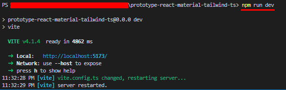
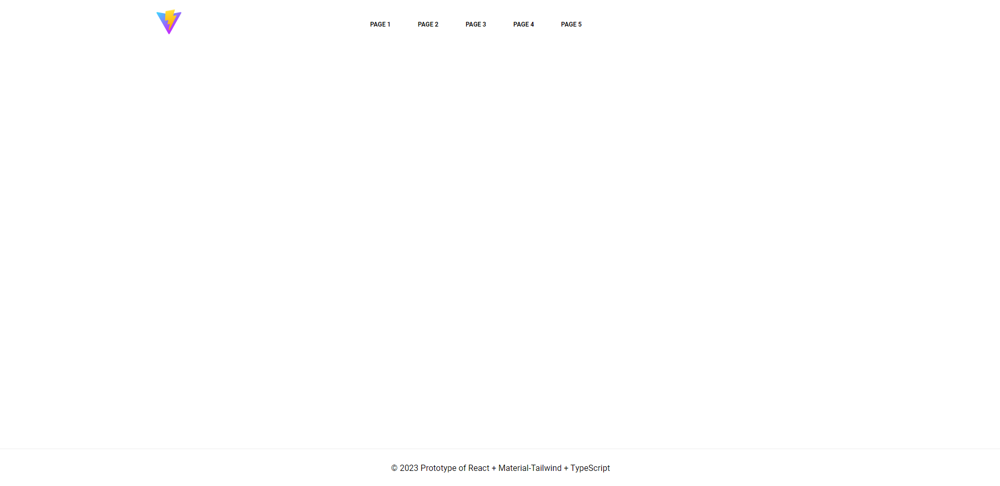

# Prototype of React + Material-Tailwind + TypeScript
Prototype of React + Material-Tailwind + TypeScript

## Contact info
- **Email:** mr.new0509@gmail.com
- **Telegram:** [@mrnew0509](https://t.me/mrnew0509)
- **Skype:** [@sin085](https://join.skype.com/invite/xat3AgpiRVOI)

## Release date
TBD

## Environment
- `Node.js v18.12.1`

## Stack
- **Framework:** `React.js v18.2.0`
- **Theme:** `Material-Tailwind v1.4.2`

## How to run the project.
1. Please open terminal window in the root directory.
2. Please run command `npm run dev` in it.

3. You can see a site like the following image if it is run correctly.

