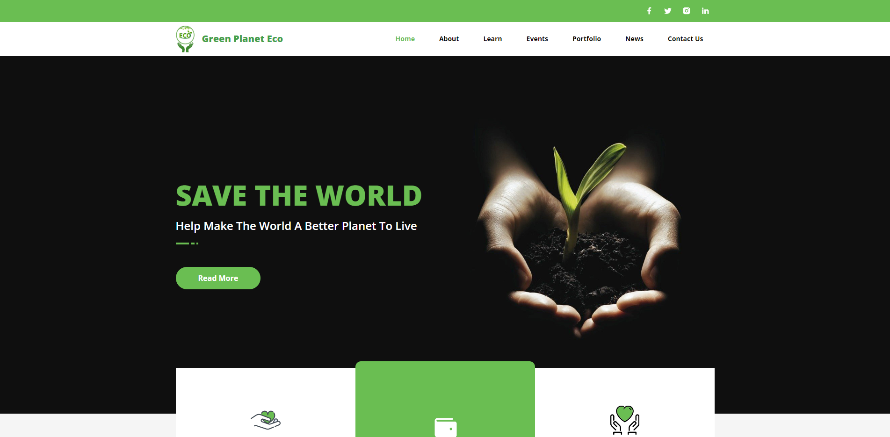

# The website of Green Planet Eco

The website of a New Zealand green technology company, Green Planet Eco.

## Live site

## Contact info

- **Email:** atsuokoizumi@gmail.com
- **Telegram:** [@silivex](https://t.me/silivex)
- **Discord** [silivex](https://discordapp.com/users/829485006904754209)

## Release date

May 12, 2023

## Environment

- `Node.js v18.12.1`

## Stack

- **Framework:** `React.js v18.2.0`
- **Theme:** `Material-Tailwind v1.4.2`

## How to run the project.

1. Please open terminal window in the root directory.
2. Please run command `npm run dev` in it.
